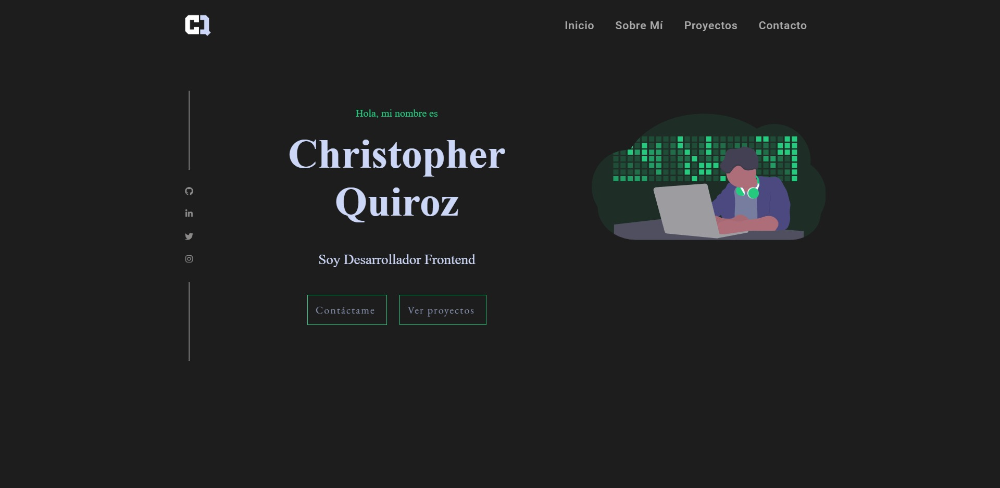
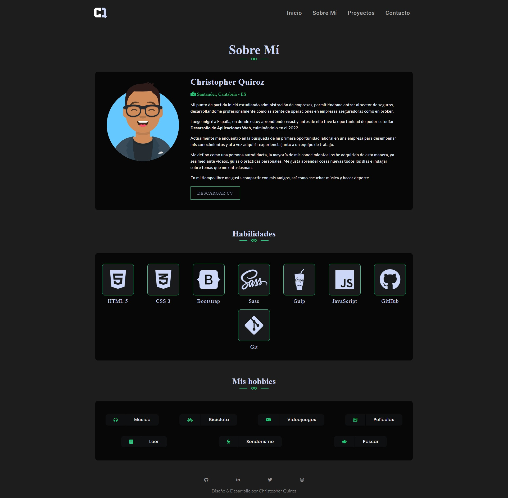
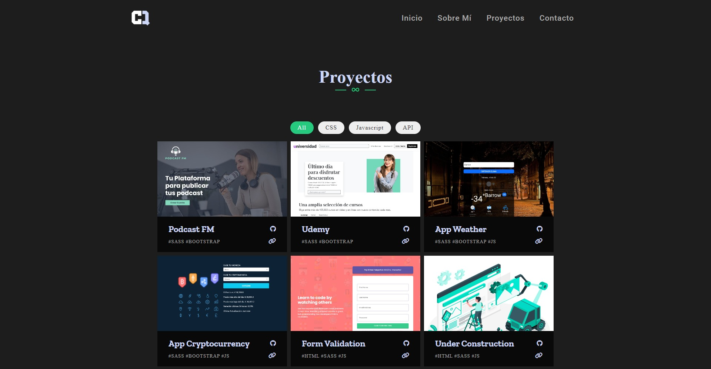
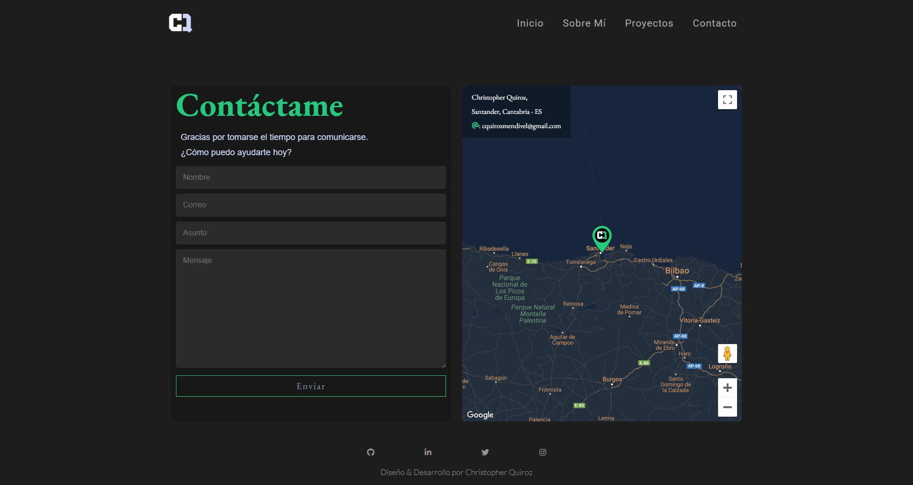

# Portfolio personal

Mi portfolio se encuentra realizadas con las tecnologías mencionadas líneas abajo, como punto de partida, inicie con el prototipo a través de Adobe xD, siendo un sitio  multi page.

- Tecnologias usadas:
  - Adobe XD
  - HTML
  - CSS
  - SASS
  - JavaScript
  - Python
  - Django
  

- Inicio:
  - La página index, representa una breve descripción sobre mí, permitiendo al usuario obtener mayor detalle a través de los enlaces.

- Sobre Mí:
  - Descripción en base a las experiencias profesionales realizadas, así como el giro profesional por dedicarme al sector TI.
  - Tecnologías que uso en mi día a día.
  - Hobbies que realizo en mis tiempos libres.
  
 - Proyectos:
    - Los proyectos se encuentran almacenados en la BD (imagen, titulo, hashtag tecnologías, url github, url despliegue).
    - En base al punto anterior, renderizo los proyectos obtenidos desde la BD, permitiendo al usuario acceder al repositorio o al despliegue del mismo.
    - Así como filtrar los proyectos, a traves de las tecnologias (All, css, js, api). 
  
- Contacto:
    - Formulario a través de ajax.
    - Por último, la renderización del mapa es gracias a la API (Google Maps).
    

 

